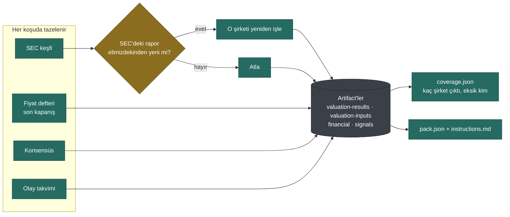
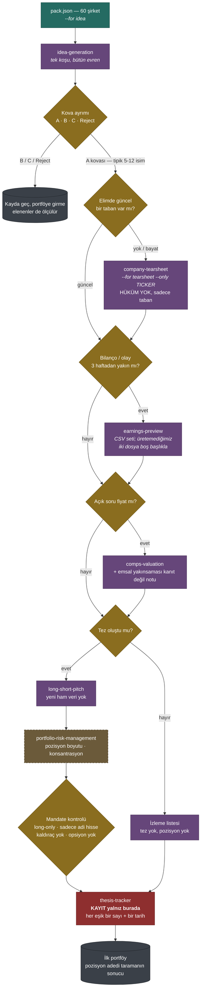
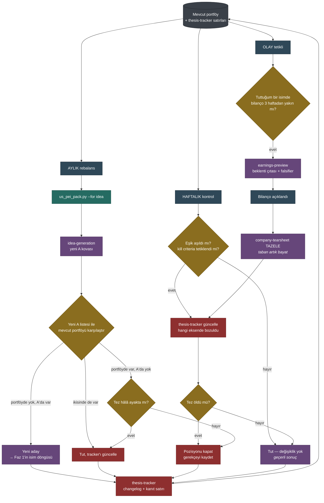

# Public Equity Investing akışı

> **YÜRÜRLÜKTEN KALKTI.** Bu diyagram mevcut kodun akışını gösteriyor
> (idea-generation → bucket → workflow zinciri → tez). Yeni tasarımda bu akış
> yok: keşif hattı sona alındı, workflow zinciri sabit dispatch kurallarına
> dönüştü, tez ayrı bir lifecycle nesnesi oldu ve araya iki aşamalı insan
> adjudication'ı girdi.
>
> Güncel akış: [pei-company-lifecycle-tasarim.md](pei-company-lifecycle-tasarim.md)
> Bölüm 4 (karar akışı), Bölüm 5 (izleme döngüsü), Bölüm 6 (otomatik
> araştırma operasyonu).
>
> Mevcut kodu okuyacaksanız diyagram hâlâ doğru bir tarif; yeni sistem için
> değil.

Portföy öncesi, kurulurken ve kurulduktan sonra. Kaynak:
[docs/pei-workflow.md](pei-workflow.md) Bölüm 2-3,
`scripts/us_pei_pack.py` içindeki `STEP_BLOCKS`, `us/config/mandate.json` ve
eklentinin `skills/company-tearsheet/SKILL.md` dosyası.

Renk kodu: yeşil = bizim deterministik katmanımız, mor = ChatGPT skill'i,
sarı = karar noktası, kırmızı = kayıt, kesikli kahverengi = **henüz
kurulmadı**.

## Faz 0 — veri katmanı, tek komut

Tetik takvim değil **dosyalama**: SEC'de bir şirketin yeni 10-K/10-Q'su
elimizdekinden yeniyse yalnız o şirket yeniden işlenir.

```bash
python scripts/us_pei_pack.py --for idea
```



Kesim, fiyat defterindeki **son kapanmış seans**; klasör adı paketin üretildiği
gün. Pazartesi sabahı üretilen paketin kesimi Cuma'dır.

## Faz 1 — portföyü ilk kez kurmak

A kovasındaki sorular bir zincir değil, her isim için ayrı ayrı sorulan
bağımsız kapılar. Bir isim hiçbirinden geçmeyebilir.



> **Kurulmadı:** `portfolio-risk-management` eklentide var ama hiç koşulmadı ve
> `STEP_BLOCKS`'ta karşılığı olan bir paket adımı yok — "A listesinden
> pozisyona" geçişte bugün otomatik hiçbir şey yok. `thesis-tracker`'ın kayıt
> şeması [pei-workflow.md](pei-workflow.md) Bölüm 5'te tasarlandı, henüz bir kez
> bile kullanılmadı.

## Faz 2 — portföy kurulduktan sonra

Üç ayrı saat: haftalık kontrol, aylık rebalans, ve bunlardan bağımsız olay
tetiklemesi. Mandate'in açık hükmü: ikisi de portföyü değiştirmek **zorunda
değil**.



> **Mandate'in kayıtlı gerilimi:** eklentinin varsayılan ufku 3-18 ay, bu
> mandate aylık rebalans yapıyor. Ölçüldü: aylık kararlar ortalama **46 gün
> eski** veriye dayanıyor ve şirket-aylarının **%32'sinde** karardan sonraki 30
> gün içinde yeni bir 10-Q/10-K geliyor. Alternatif, takvimi değil
> **dosyalamayı** tetik almak; `next_events` tarihleri paketin içinde.

## Hangi adım hangi bloğu görüyor

`--for` değeri paketin içeriğini değiştirir. Ölçüldü: ORCL tearsheet'inde
`sector_peers` paketin %36'sıydı ve çıktıda yalnız "bu emsal grubu heterojen"
denip reddedilmek için kullanıldı.

| Blok | idea | tearsheet | preview | comps | deepdive | pitch |
|---|:--:|:--:|:--:|:--:|:--:|:--:|
| net_debt | ● | ● | ● | ● | ● | ● |
| special_situations | ● | ● | ● | ● | ● | ● |
| earnings_quality_flags | ● | ● | ● | ● | ● | ● |
| next_events | ● | ● | ● | – | ● | ● |
| roic | ● | ● | – | ● | ● | ● |
| own_valuation_history | ● | ● | – | ● | – | ● |
| deterministic_signals | ● | – | ● | – | ● | ● |
| sector_peers | – | – | – | ● | – | ● |
| quarterly_series | – | – | – | – | ● | – |
| pre_print_consensus | – | – | – | – | ● | – |

## Bugün gerçekten ne çalışıyor

- **Çalışıyor:** veri katmanı tek komutta; kapsama ROIC 49/60, net borç 58/60,
  konsensüs ve sinyaller 60/60.
- **Bir kez koşuldu:** `idea-generation` (evren) ve `company-tearsheet` (ORCL).
- **Paket adımı var, hiç koşulmadı:** `preview`, `comps`, `deepdive`, `pitch`.
- **Hiç yok:** `thesis-tracker` kaydı ve `portfolio-risk-management`.
- **Belirsiz bırakılmış:** pozisyon adedi (taramanın sonucu) ve benchmark (yok —
  sonuçlar aktif ağırlık çerçevesinde yorumlanmamalı).
