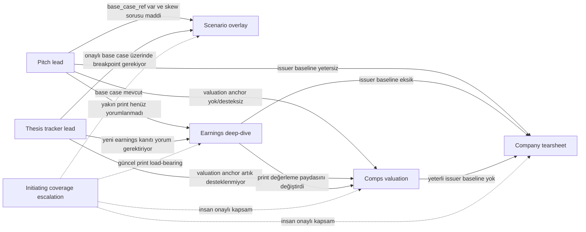
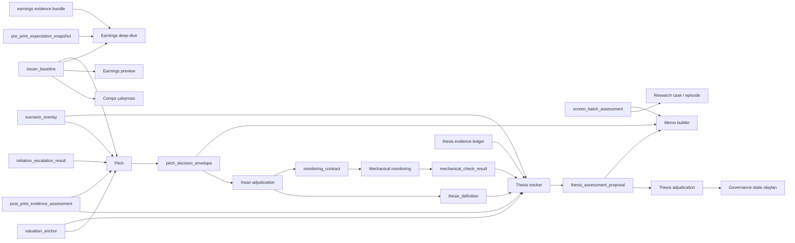
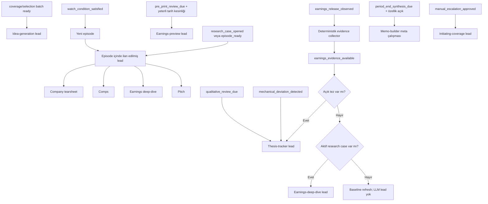

Ana sonuç: üç ayrı ilişkiyi tek katalog oku olarak tutmamalıyız. Support çağrıları workflow politikasına, artefakt bağımlılıkları sözleşmelere, olay yönlendirmesi ise ayrı `dispatch_routes` bölümüne ait.

## 1. İlişki grafikleri

### A. Lead hangi support’u çağırabilir?



Kasten bulunmayan oklar:

- Idea-generation Tur 1 sırasında otomatik support açmaz; kanıt yetersizse `insufficient_screen_evidence` üretir. Aksi hâlde bazı isimler daha zengin araştırmayla değerlendirilip batch karşılaştırması bozulur.
- Earnings-preview dar V1 sözleşmesinde support açmaz.
- Memo-builder yeni analiz sipariş etmez; mevcut artefaktları sentezler.
- Scenario V1’de hiçbir zaman lead değildir.
- Financials-normalizer yoktur; deterministik finansal boru hattı otoritedir.

Pitch için kabul ettiğimiz `max_automatic_supports: 1` kalmalı. İkinci support ihtiyacı vakayı otomatik fan-out’a değil, operatör seçimine götürür.

### B. Artefakt bağımlılıkları



Buradaki temel kurallar:

- Artefakt gereksinimi skill completion değildir. Pitch, “comps çalıştı mı?” diye değil, “güncel ve destekli `valuation_anchor` var mı?” diye sorar.
- Scenario overlay hiçbir zaman `base_case_ref`in epistemik seviyesini yükseltmez.
- Initiating coverage doğrudan tez açamaz; çıktısı yine pitch/adjudication kapısından geçer.
- Memo çıktıları lifecycle’a geri yazılmaz.

### C. Hangi olay hangi lead’i tetikler?



`earnings_release_observed` doğrudan deep-dive çalıştırmaz; yalnız kanıt toplama sürecini başlatır. Lead ancak `earnings_evidence_available` sonrasında ve mevcut domain durumuna göre seçilir.

`thesis_opened` da tracker çağırmamalı; monitoring programını deterministik olarak kurmalı. Tracker ancak yeni maddi evidence, mekanik sapma veya nitel inceleme vadesiyle çalışır.

## 2. Yeni `pei-workflows.json` yapısı

Dosya yalnız `workflows` sözlüğü olmaktan çıkmalı:

```json
{
  "catalog_schema_version": 2,
  "runtime_defaults": {},
  "policy_dependencies": {},
  "pack_contracts": {},
  "artifact_contracts": {},
  "validator_sets": {},
  "workflows": {},
  "dispatch_routes": []
}
```

- `runtime_defaults`: ortak timeout, retry ve artefakt politikasını tekrar etmemek için.
- `policy_dependencies`: şemsiye skill ve zorunlu shared sözleşmeleri tek yerde sürümlemek için.
- `pack_contracts`: yedi input-pack sözleşmesini workflow’lardan bağımsız tanımlamak için.
- `artifact_contracts`: `issuer_baseline`, `valuation_anchor`, `monitoring_contract` gibi yetenekleri skill adlarından ayırmak için.
- `validator_sets`: deterministik semantic validator’ları sürümlü ve tekrar kullanılabilir tutmak için.
- `workflows`: skill çağırma politikasını tanımlamak için.
- `dispatch_routes`: olay + domain state → lead seçimini workflow geçişlerinden ayırmak için.

### Örnek workflow girdisi: pitch

```json
{
  "skill_id": "long-short-pitch",
  "executable": true,
  "availability": "core",
  "eligible_roles": ["lead"],
  "subject_types": ["research_case"],
  "dispatch_eligibility": [
    "episode.lead_workflow == 'pitch'",
    "research_case.status == 'open'"
  ],
  "input_pack": {
    "contract_id": "pitch_decision.v1",
    "builder_id": "pitch_decision",
    "schema_version": 1
  },
  "hard_artifact_requirements": [
    {
      "artifact_type": "issuer_baseline",
      "minimum_schema_version": 1,
      "freshness_policy": "issuer_baseline.v1",
      "on_missing": "request_support"
    },
    {
      "artifact_type": "valuation_anchor",
      "minimum_schema_version": 1,
      "required_predicate": "support_status == 'supported'",
      "freshness_policy": "valuation_anchor.v1",
      "on_missing": "request_support"
    }
  ],
  "support_policy": {
    "allowed": [
      {
        "workflow_id": "company_tearsheet",
        "when": "issuer_baseline_missing_or_stale",
        "expected_artifact": "issuer_baseline"
      },
      {
        "workflow_id": "comps",
        "when": "valuation_anchor_missing_or_unsupported",
        "expected_artifact": "valuation_anchor"
      },
      {
        "workflow_id": "scenario",
        "when": "base_case_ref_present_and_scenario_question_material",
        "expected_artifact": "scenario_overlay"
      },
      {
        "workflow_id": "earnings_deep_dive",
        "when": "material_post_print_evidence_unassessed",
        "expected_artifact": "post_print_evidence_assessment"
      }
    ],
    "max_automatic_supports": 1,
    "on_budget_exceeded": "require_human_selection",
    "support_may_change_lead": false,
    "support_may_close_case": false
  },
  "output_contracts": [
    {
      "artifact_type": "pitch_decision_envelope",
      "schema_ref": "schemas/pitch-decision-envelope.v1.json",
      "schema_version": 1,
      "required": true
    },
    {
      "artifact_type": "thesis_draft",
      "schema_ref": "schemas/thesis-definition-draft.v1.json",
      "schema_version": 1,
      "required_when": "verdict == 'actionable_candidate'"
    },
    {
      "artifact_type": "exposure_intent",
      "schema_ref": "schemas/exposure-intent.v1.json",
      "schema_version": 1,
      "required_when": "verdict == 'actionable_candidate'"
    },
    {
      "artifact_type": "monitoring_contract_draft",
      "schema_ref": "schemas/monitoring-contract-draft.v1.json",
      "schema_version": 1,
      "required_when": "verdict == 'actionable_candidate'"
    }
  ],
  "validation_policy": {
    "validator_sets": [
      "artifact_integrity.v1",
      "pitch_completeness.v1",
      "long_only_mandate.v1",
      "monitoring_traceability.v1"
    ],
    "on_failure": "block_attempt"
  },
  "model_policy": {
    "rules": [
      {
        "role": "lead",
        "reliance_class": "decision_support",
        "model": "gpt-5.6-sol",
        "effort": "xhigh"
      },
      {
        "role": "lead",
        "reliance_class": "red_team",
        "model": "gpt-5.6-sol",
        "effort": "high"
      }
    ]
  },
  "human_gates": [
    {
      "gate_id": "thesis_opening_adjudication",
      "at": "before_domain_commit",
      "when": "proposed_transition == 'open_thesis'",
      "required": true
    },
    {
      "gate_id": "case_decline_adjudication",
      "at": "before_domain_commit",
      "when": "proposed_transition == 'decline_case'",
      "required": true
    }
  ],
  "lifecycle_authority": {
    "may_propose": ["open_thesis", "watch_until", "decline_case"],
    "may_commit": []
  },
  "runtime_contracts": [
    "public-equity-investing@0.1.31",
    "support-layer-routing-contract@1",
    "invocation-policy@1",
    "internal-analysis-artifact-policy@1"
  ],
  "artifact_policy": {
    "mode": "internal_analysis",
    "structured_output_mode": "direct_sidecar",
    "forbidden": ["standalone_html"]
  },
  "execution_policy": {
    "timeout_seconds": 900,
    "operational_retries": 1,
    "contract_failure_retries": 0,
    "commit_serialization": "required"
  }
}
```

### Workflow girdisindeki alanların gerekçesi

- `skill_id`: Katalog kimliğini eklentideki gerçek skill kimliğine bağlar.
- `executable`: Policy dependency ile gerçekten çağrılabilir workflow’u ayırır.
- `availability`: `core`, `conditional`, `escalation_only` ve `disabled` ayrımını taşır.
- `eligible_roles`: Rolü skill’e kalıcı yapıştırmadan hangi rollerde kullanılabileceğini sınırlar; gerçek rol work-item’da bulunur.
- `subject_types`: Batch, security, research case, thesis veya review period gibi yanlış subject’le çağrıyı önler.
- `dispatch_eligibility`: Event routing seçse bile workflow’un mevcut domain durumunda çalıştırılabilir olup olmadığını kontrol eder.
- `input_pack`: `pack_step` yerine gerçek pack contract, builder ve sürümü tanımlar.
- `hard_artifact_requirements`: Skill completion yerine gerekli bilgi yeteneklerini, tazelik şartını ve eksiklik davranışını belirtir.
- `support_policy`: Lead’in hangi support’u hangi boşluğu kapatmak için ve hangi bütçeyle çağırabileceğini tanımlar.
- `output_contracts`: Tek string yerine bütün doğrudan sidecar’ları, şemalarını ve koşullu zorunluluklarını taşır.
- `validation_policy`: Şema sonrasındaki deterministik anlam/invariant kontrollerini seçer.
- `model_policy`: Modeli skill adına değil rol ve reliance sınıfına göre seçer.
- `human_gates`: Tek boolean yerine kapının hangi transition öncesinde ve hangi koşulda gerektiğini söyler.
- `lifecycle_authority`: Skill’in ne önerebileceğini ve neyi kendi başına commit edemeyeceğini açıklar.
- `runtime_contracts`: Şemsiye ve shared policy bağımlılıklarını dolaylı prompt umuduna bırakmaz.
- `artifact_policy`: İç analiz/HTML yasağı ile direct structured sidecar beklentisini zorlar.
- `execution_policy`: Operasyonel retry ile semantic contract failure’ı ayırır ve commit serileştirmesini belirtir.

`handoff_suggestions` katalog geçişi değildir; output contract içindeki bağlayıcı olmayan analitik öneridir. `allowed_next` tamamen silinmelidir.

`workflow_request_id`, `attempt_id`, gerçek `execution_role`, `reliance_class` ve seçilmiş support bütçesi katalog alanı değil, runtime work-item alanıdır.

## 3. Kaç çalıştırılabilir giriş?

Benim net cevabım: **10 adet `executable: true` giriş**.

### V1 çekirdeği: 6

1. `idea_generation` — batch lead  
2. `company_tearsheet` — lead veya embedded support  
3. `comps` — lead veya embedded support  
4. `earnings_deep_dive` — event lead veya embedded support  
5. `pitch` — karar lead’i  
6. `thesis_tracker` — lifecycle lead’i  

### Koşullu: 3

7. `earnings_preview` — doğrulanmış pre-print inceleme ihtiyacında  
8. `scenario` — yalnız geçerli `base_case_ref` ile embedded support  
9. `memo_builder` — dönem-sonu sentezi açıkça istendiğinde; lifecycle yetkisi yok  

### Escalation-only: 1

10. `initiating_coverage` — ürün sınırı dışında, yalnız dispatch öncesi insan onayıyla  

Buna ek olarak:

- `public_equity_investing`: katalogda bulunur ama `executable: false`; runtime policy dependency/meta girdisidir.
- `mechanical_monitoring`, evidence collector, validator, pack builder ve projector skill değildir; ayrı deterministic service registry’sinde durmalıdır.
- Financials-normalizer ve diğer elenen skill’ler bu workflow kataloğuna hiç girmez.

Dolayısıyla dosyada **11 skill girdisi**, bunların **10’u çalıştırılabilir**, **1’i non-executable meta dependency** olur. “Normal otomatik rota” sayısı ise daha küçüktür: initiation hiçbir zaman otomatik seçilemez; scenario, preview ve memo da kendi koşulları oluşmadan dispatch edilemez.